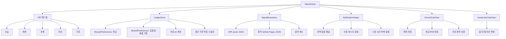
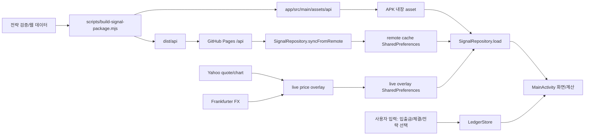

# Android App Map

작성일: 2026-07-09

이 문서는 현재 Investor Run Android 앱의 화면, 데이터, 저장소, 전략 계산, 빌드 산출물 지도를 기록한다. 새 기능을 설계하거나 버그를 수정할 때는 `android_app_agent_coding_rules.md`와 `android_app_team_roles.md`를 먼저 확인한 뒤 이 지도를 갱신한다.

기준 버전:

- 앱 ID: `com.sweethome.investor`
- 앱 이름: `Investor Run`
- 현재 소스 버전: `0.3.43`
- 현재 소스 versionCode: `55`
- 최신 빌드 완료 APK: `artifacts/investor-run-debug-0.3.43.apk`
- `0.3.43` APK 상태: 빌드 완료
- 구현 방식: Java 네이티브 Android, XML 레이아웃 없이 `MainActivity`에서 프로그램 방식 UI 구성

## 1. 최상위 구조



## 2. 핵심 파일 지도

| 파일 | 현재 책임 |
| --- | --- |
| `app/src/main/java/com/sweethome/investor/MainActivity.java` | 앱 진입점, 5개 탭, 모든 화면 렌더링, 주문/입출금/전략 선택 다이얼로그, 전략 계산 결과 표시, ETF 리밸런싱 실행 가이드, 증권사 보유 대조 |
| `app/src/main/java/com/sweethome/investor/StrategyMath.java` | 주문 목표, 추가 매수 수량, 미국 Cap27.5, 한국 Leader2, ETF 리밸런싱, 원금 기준 USD 자산 변화 순수 계산 |
| `app/src/main/java/com/sweethome/investor/LedgerStore.java` | 계좌 정의, 현금 저장, 입출금/매수/매도/환전/배당 검증 저장, USD 입출금/환전/배당 환율 기록, 과거 기록 취소/정정, 입출금/매수/매도 정정 저장, 정정용 과거 lot 후보 계산, 월간 주문 목표 스냅샷, 자산 스냅샷 저장, 장부 손상 보호, 최신 기록 되돌리기, JSON 백업/복원, Action 보류, FIFO lot 계산, 특정 lot 매도 차감, 6개월/12개월 매도 이벤트 계산, 매도 실현손익 저장, 수수료/세금 비용 집계, 세전/세후 배당과 배당세 집계, 평균 원가 임시 평가 판단, 전체/계좌별 손익 집계, 총자산/계좌별 평가 계산 |
| `app/src/main/java/com/sweethome/investor/SignalRepository.java` | asset/remote/cache 신호 패키지 로드, 가격/환율/주봉/ETF 목표 비중 파싱, API key 없는 Yahoo/Frankfurter 직접 시세 overlay, quote/FX 신뢰도 계산, manifest hash/schema/status 검증, 원격 동기화와 캐시 보호 |
| `app/src/main/java/com/sweethome/investor/Ui.java` | 색상, 카드, 버튼, pill, 텍스트, progress 등 공통 UI 헬퍼. v0.3.36부터 버튼/카드 밀도는 모바일 실전 운용 화면 기준으로 조정 |
| `app/src/main/java/com/sweethome/investor/DonutChartView.java` | 도넛 차트 커스텀 View |
| `app/src/main/java/com/sweethome/investor/AssetLineChartView.java` | 총자산/투자 중 자산/현금 변화 라인 차트 커스텀 View |
| `app/src/main/java/com/sweethome/investor/MarketCalendar.java` | 한국/미국 시장 휴장일 캘린더. 미국장은 2028년 이후 주요 휴장/조기폐장 규칙 계산, 한국장은 확정 수동 데이터와 연말 휴장 보조 |
| `app/src/main/java/com/sweethome/investor/NotificationHelper.java` | Android 알림 채널, 즉시 알림, 휴장일 반영 시장 시간 반복 알림, 동적 알림 본문 |
| `app/src/main/java/com/sweethome/investor/StrategyNotificationReceiver.java` | 예약 알림 수신 후 알림 표시, 같은 종류 다음 알림 재예약 |
| `app/src/main/java/com/sweethome/investor/BootScheduleReceiver.java` | 기기 재부팅 또는 앱 업데이트 후 시장 알림 재예약 |
| `app/src/main/AndroidManifest.xml` | 인터넷/알림/부팅 권한, `MainActivity`, 알림 receiver 등록 |
| `app/src/test/java/com/sweethome/investor/StrategyMathSelfTest.java` | 외부 의존성 없이 실행 가능한 전략 계산/원금 기준 자산 변화 실전 시나리오 self-test |
| `scripts/build-signal-package.mjs` | 웹 전략 결과에서 앱용 정적 API 패키지 생성, asset 복사 |

## 3. 화면 지도

### 오늘

목적: 사용자가 오늘 실제로 해야 할 행동을 바로 확인한다.

구성:

- 데이터 상태 카드: 신호 기준일, 가격 기준일, 환율 기준일, 가격/환율/quote 문제, 사용 중 시세 기준, GitHub 동기화 성공/실패, 직접 시세 성공/실패 표시
- 총자산 카드: 총자산, USD/KRW, 현금, 투자/현금 비중
- 시장 시간 순서 카드: 한국장, 연금 ETF, 미국장
- Action Inbox:
  - 첫 실행이면 계좌 설정 필요 카드
  - 월간 매수 신호 카드
  - ETF 리밸런싱 카드
  - 주봉 훼손 감시/매도 검토 카드
  - 데이터가 지연/대체/실패 상태인 주문 액션은 `데이터 확인`으로 차단
  - `오늘 보류`를 누르면 해당 액션은 오늘 목록에서 숨김

주요 연결:

- 매수 신호는 데이터 정상 시 `showOrderGuide()`로 이동, 데이터 문제 시 기록 탭으로 이동
- ETF 신호는 데이터 정상 시 `showEtfRebalanceGuide()`로 이동, 데이터 문제 시 기록 탭으로 이동
- 주봉 훼손 보유 종목은 `showManualSellDialog()`로 이동

### 계좌

목적: 미국, 한국, ETF 계좌를 분리해 보고 총자산은 통합한다.

구성:

- 미니탭: `전체`, `미국`, `한국`, `ETF`
- 전체 화면:
  - 계좌별 자산 비중 도넛 차트
  - 계좌 카드 3개
- 개별 계좌 화면:
  - 계좌 카드
  - 현금/보유 비중 도넛 차트
  - 보유 종목 비중 도넛 차트
- 계좌 카드:
  - 원화 환산 총액
  - 현금, 보유 평가, 보유 종목 수
  - 미국 계좌는 `USD 현금`과 `보조 KRW`를 별도 표시
  - 입금, 출금, 계좌명 변경

계좌 정의:

| accountId | 기본 이름 | 기준 통화 | 운용 영역 |
| --- | --- | --- | --- |
| `us_stock` | 미국 주식 계좌 | USD | 미국 주식 |
| `kr_stock` | 한국 주식 계좌 | KRW | 한국 주식 |
| `pension_etf` | 연금 ETF 계좌 | KRW | 한국 ETF |

### 운용

목적: 미국, 한국, ETF 전략을 완전히 분리해 주문 가이드를 제공한다.

구성:

- 미니탭: `미국`, `한국`, `ETF`
- 전략 선택 카드:
  - 현재 전략
  - 기준 통화
  - 전략 설명
  - 전략 바꾸기 다이얼로그
- 추천/리밸런싱 카드:
  - 예산 정책(`orderHint`)
  - 유효 시작일(`validFrom`)
  - 목표 원금
  - 현재 원금
  - 남은 매수 금액
  - 추가 권장 금액/수량
  - 매수 평균가
  - 평단 대비
  - 기준가
  - 가격 상태
  - 목표 대비 진행률
  - 주문 가이드 버튼
  - 데이터가 정상 아닐 때 `데이터 확인 필요` 버튼
- 보유 lot 카드:
  - 보유 수량
  - 평가금액
  - 현재가
  - 평균 원가
  - 원금 기준 평가 비율
  - 주봉 기준선
  - 주식 계좌 lot 일정: 매수일, 잔여 수량, 6개월/12개월 D-day
  - 6개월 50% 매도, 12개월 전량 매도, 주봉 훼손 잔여 매도 액션
  - 매도 기록 버튼

현재 선택 가능한 전략:

| 계좌 | 신호 연결됨 | 후보/연구 선택지 |
| --- | --- | --- |
| 미국 | `us_leader2_repeat_theme_combo_cap27_5` | `us_leader2_score_c_cap27_5` candidate, `us_repeat_theme_combo_cap30`, `us_conviction_diverse_top2` |
| 한국 | `kr_stock_leader2` | `kr_stock_no_repeat` |
| ETF | `kr_etf_core_satellite_50_40_10` | `kr_etf_core_satellite_60_30_10`, `kr_etf_core_satellite_40_40_20` |

주의:

- `candidate` 전략은 신호 패키지에 데이터가 있으면 앱에서 주문 가이드를 표시한다.
- 연구 선택지는 선택 UI만 존재한다.
- 추천주와 비중 가이드를 내려면 신호 패키지에 해당 전략 데이터가 추가되어야 한다.

### 자산

목적: 총자산과 계좌별 자산 구성을 확인한다.

구성:

- 총자산 카드
- 일/주/월 자산 변화 라인 차트
- 원금 기준 요약 카드
  - 원금 대비, 투자 손익, 환율 영향 3칸 요약
  - 현재 총자산
  - 입금 원금
  - 원금 대비 변화
  - 현재 투자 손익
  - 환율 영향
  - USD/KRW 변화
  - 기존 USD 입금 환율 추정 사용 여부
- 일/주/월 손익 추세 라인 차트
- 손익 추세는 현재 `pnlBasisVersion` 기준 스냅샷만 사용해 stale quote 기준 과거 손익과 live quote 기준 현재 손익을 섞지 않음
- 총자산 계좌 비중 도넛 차트
- 전체 보유 종목 비중 도넛 차트
- 계좌별 자산 카드
- 손익 분해 카드
  - 투자 손익
  - 실현손익
  - 미실현손익
  - 실현 매도 수
  - 원가 필드가 없는 과거 매도 기록 수

현재 한계:

- 자산 변화 그래프는 앱 내부 일자별 스냅샷 기준이다. 브로커 체결 내역 자동 수집이나 외부 계좌 잔고 검증은 아직 없다.
- 손익 분해는 실현/미실현 손익, 세후 배당, 배당세, 매수/매도 비용을 표시한다. 정밀 환전 손익은 아직 별도 이벤트/환율 히스토리 모델이 필요하다.

### 기록

목적: 체결, 현금, 데이터 동기화, 백업 관련 작업을 모은다.

구성:

- 빠른 기록:
  - 계좌별 입금
  - 추천 매수 선택 기록
  - 미국 계좌 환전 기록
- 장부 점검:
  - USD 입출금 환율 누락
  - 환전 환율 누락
  - 평균원가 임시평가 종목
  - 가격/환율 데이터 문제
  - 자산 스냅샷 수
  - 점검 필요 기록만 보기
- 기록 타임라인:
  - 기본 접힘 상태
  - 전체 기록 건수와 최근 기록 1건 요약
  - 펼치기/접기 버튼
  - 필터: 전체, 점검, 입출금, 체결, 환전, 취소
  - 입금/출금
  - USD 입출금 저장 환율 표시
  - 매수/매도 체결
  - 환전
  - 취소된 원본 기록과 정정 기록
- 데이터 동기화:
  - 신호 상태
  - 가격 상태
  - 환율 상태
  - 가격 종목 수
  - 가격 문제 개수
  - 월간 신호
  - 데이터 소스
  - GitHub 동기화 마지막 성공/실패
  - 직접 시세 마지막 성공/실패
  - 사용 중 시세 기준
  - GitHub Pages API URL 설정
  - 원격 신호/시세 동기화
  - 키 없는 시세/환율 갱신
  - 원격 캐시 삭제
- 백업과 안전장치:
  - 장부 백업 JSON 클립보드 복사
  - 장부 백업 JSON 붙여넣기 복원
  - 장부 백업 JSON 파일 저장
  - 장부 백업 JSON 파일 불러오기
  - 알림 테스트

## 4. 다이얼로그와 입력 지도

| 다이얼로그 | 진입점 | 저장/동작 |
| --- | --- | --- |
| 주문 가이드 | 오늘/운용의 주문 가이드 | 데이터 정상일 때 이번 목표, 이번 체결, 남은 매수, 추가 가능 예산, 추가 권장 수량, 예상 주문금액, 현금 표시 후 체결 기록으로 이동 |
| 매수 체결 기록 | 주문 가이드 또는 추천 매수 선택 | 저장소 검증 전 수량/평균단가/비용 sanity check, 목표 스냅샷 저장, 체결 저장 |
| ETF 리밸런싱 | 오늘/운용 ETF 카드 | target별 목표/현재/차이/권장 수량 표시, 매수/매도 기록으로 이동 |
| ETF 체결 기록 | ETF 리밸런싱 target 버튼 | 데이터 정상 여부와 입력 sanity check 후 ETF 매수/매도 저장 |
| 매도 체결 기록 | 보유 lot 또는 주봉 훼손 카드 | FIFO 자동 또는 특정 lot 선택, 50% 수량, 전량, lot 이벤트 추천 수량, 수동 수량 입력 후 저장소 검증 |
| 입금/출금 기록 | 계좌 카드, 기록 빠른 버튼 | 미국 계좌는 KRW/USD, 한국/ETF 계좌는 KRW만 허용, 금액 자동 콤마 입력, USD 기록은 저장 시점 환율 저장, 저장소 검증 |
| 입금/출금 정정 | 기록 타임라인 정정 입력 | 원본을 취소하고 새 기록을 생성, USD 입출금은 당시 USD/KRW 환율도 함께 보정, 보정 후 자산 요약 확인으로 이동 가능 |
| 환전 기록 | 기록 빠른 버튼 | 미국 계좌에서 KRW -> USD 또는 USD -> KRW 환전 기록, 현금 차감/증가 검증 |
| 기록 취소 | 기록 타임라인 | 원본을 삭제하지 않고 취소 상태와 `cancel` 정정 기록을 남김, 현금/보유 수량 음수 방지 |
| 정정 입력 | 기록 타임라인 | 입금/출금/매수 기록을 미리 채운 폼으로 수정, 내부적으로 원본 취소 + 새 정정 기록 저장 |
| 증권사 보유 대조 | 기록 빠른 버튼 | 앱 장부의 수량/평단과 증권사 수량/평단을 비교해 수량 차이와 원금 차이를 표시 |
| 장부 백업 복사 | 기록 백업과 안전장치 | 계좌명, 현금, 전략 선택, 장부 기록을 JSON으로 클립보드 복사 |
| 장부 백업 복원 | 기록 백업과 안전장치 | 백업 JSON 붙여넣기, 기본 검증 후 현재 장부와 현금 교체 |
| 장부 백업 파일 저장 | 기록 백업과 안전장치 | Android 문서 저장 화면으로 JSON 백업 파일 저장 |
| 장부 백업 파일 불러오기 | 기록 백업과 안전장치 | Android 문서 선택 화면에서 JSON 백업 파일을 읽고 확인 후 복원 |
| 계좌명 변경 | 계좌 카드 | 사용자 계좌명 저장 |
| 전략 선택 | 운용 전략 카드 | 기본 전략은 즉시 저장, 연구 전략은 경고 후 저장 |
| 데이터 확인 필요 | 데이터 지연/대체/실패 상태 주문 버튼 | 가격/환율 문제를 보여주고 기록 탭으로 이동 |
| GitHub Pages API URL | 기록 데이터 동기화 | 원격 URL 저장, 필요 시 즉시 동기화 |
| 키 없는 시세/환율 갱신 | 기록 데이터 동기화 | 추천/보유 종목 가격은 Yahoo quote/chart, USD/KRW는 Frankfurter 후 Yahoo KRW=X fallback으로 갱신 |

## 5. 데이터 흐름 지도



로드 우선순위:

1. 원격 캐시가 있고 APK 내장 `packageVersion`보다 오래되지 않았으면 `remote cache` 사용
2. 캐시가 없거나 APK asset이 더 최신이면 캐시 삭제 후 asset 사용
3. 앱 실행, foreground 복귀, 오늘/운용/자산 화면 진입 시 15분 throttle로 자동 동기화 시도
4. 원격 데이터가 현재 APK 내장 데이터보다 오래되면 적용하지 않음
5. 원격 manifest의 schema, 필수 파일, status, sha256 검증을 통과해야 cache를 교체함
6. GitHub Actions는 한국장 개장/마감, 미국장 개장/마감, Yahoo 지연 반영 재시도 시간대에 Pages API를 갱신한다.
7. 추천/보유 종목의 직접 가격은 GitHub 패키지를 바꾸지 않고 live overlay로 덮어쓴다.
8. USD/KRW는 Frankfurter 공개 환율을 우선 쓰고 실패하면 Yahoo `KRW=X`를 쓴다.
9. `KR_ETF_BASKET` 같은 전략용 가상 심볼은 직접 가격 조회 대상에서 제외하고, ETF는 실제 target 종목만 조회한다.

현재 내장 API 파일:

| 파일 | 내용 |
| --- | --- |
| `api/manifest.json` | 패키지 버전, 파일 목록, 해시, 상태 |
| `api/signals/latest.json` | 미국/한국/ETF 최신 실행 신호와 ETF 목표 비중 |
| `api/weekly-trends/latest.json` | 주봉 추세 상태, 기준선, 훼손 여부 |
| `api/prices/latest.json` | 종목별 현재가/기준가, 가격 상태 |
| `api/fx/latest.json` | USD/KRW 환율 |

현재 내장 데이터 요약:

- 신호 월: `2026-07`
- 신호 기준일: `2026-07-08`
- 가격 기준일: `2026-07-08`
- 환율 기준일: `2026-07-08`
- 가격 종목 수: `26`
- 주봉 추세 수: `7`
- 가격/환율 상태: `delayed`

## 6. 현재 전략 계산 지도

### 미국 `Leader2 + Repeat Theme Combo Cap27.5`

현재 코드 계산:

- 핵심 계산은 `StrategyMath`의 순수 함수로 수행한다.
- 계좌 평가액 기준으로 목표 주문 금액 산출
- 기본 매수 비율:
  - 현금이 계좌 평가액의 10% 이하이면 5%
  - 매수 기록 6회 미만이고 현금이 평가액의 30% 이상이면 10%
  - 그 외 7.5%
- 반복 추천 가중:
  - 동일 종목 이전 매수 1회 이상: 1.25배
  - 동일 종목 이전 매수 2회 이상: 1.45배
- AI/하드웨어 섹터 가중: 1.25배
- 방어/약세 섹터 감산: 0.85배
- 최대 multiplier: 1.85배
- 종목별 누적 원금 상한: 27.5%
- 주문 가능 금액은 수수료 버퍼를 뺀 현금 이내

현재 내장 신호:

- `TECH` Bio-Techne
- `STX` Seagate Technology

### 한국 주식 `KR Stock Leader2`

현재 코드 계산:

- 핵심 계산은 `StrategyMath`의 순수 함수로 수행한다.
- 계좌 평가액 기준으로 목표 주문 금액 산출
- 매수 신호 수로 월간 배정 금액을 나눔
- 초기 구간: 월 30%
- 이후 구간: 월 15%
- 종목별 누적 원금 상한: 22.5%
- 수수료 버퍼 적용
- 최소 주문 현실성은 `validationText()`에서 기준가/최소 단위로 판정

현재 내장 신호:

- `009150.KS` 삼성전기
- `000660.KS` SK하이닉스

### 한국 ETF `Core/Satellite/Defense 50/40/10`

현재 코드 계산:

- 핵심 계산은 `StrategyMath`의 순수 함수로 수행한다.
- 연금 ETF 계좌 평가액 기준
- ETF 목표 비중:
  - `360750.KS` TIGER 미국S&P500: 50%
  - `395160.KS` KODEX 시스템반도체: 40%
  - `458730.KS` TIGER 미국배당다우존스: 10%
- 현재 보유 평가액과 목표 금액의 차이를 계산
- 차이가 목표 대비 작거나 5만원 이하이면 `유지`
- 아니면 매수/매도 수량을 정수 주식 단위로 계산

## 7. 장부와 자산 계산 지도

저장 위치:

- `SharedPreferences`: `investor_ledger`
- 현금 key: `cash_{accountId}_{currency}`
- 기록 key: `entries_v2`
- 자산 스냅샷 key: `asset_snapshots_v1`
- 월간 주문 목표 key: `order_targets_v1`
- 계좌명 key: `account_name_{accountId}`
- 전략 선택 key: `selected_strategy_{accountId}`
- 장부 손상 백업 key: `corrupt_entries_backup`, `corrupt_entries_message`
- Action 오늘 보류 key: `snoozed_action_{yyyy-MM-dd}_{actionKey}`

기록 타입:

| type | 의미 |
| --- | --- |
| `deposit` | 입금, 현금 증가. USD 기록은 저장 시점 `fxRateKrw`를 함께 저장 |
| `withdraw` | 출금, 현금 감소. USD 기록은 저장 시점 `fxRateKrw`를 함께 저장 |
| `buy` | 매수, 현금 감소, 보유 lot 증가 |
| `sell` | 매도, 현금 증가, 보유 lot 감소 |
| `fx` | 미국 계좌 환전, 한 통화 현금 감소와 다른 통화 현금 증가. 원화/달러 변환이면 계산된 `fxRateKrw` 저장 |
| `cancel` | 과거 기록 취소/정정 감사 추적, 원본 기록은 `voidedAt`으로 표시, 최신 정정은 되돌리기 가능 |

평가 계산:

- 보유 lot은 취소되지 않은 매수/매도 기록을 순서대로 누적해 계산한다.
- 주식 계좌의 lot 일정은 별도 저장 row가 아니라 `entries_v2`에서 매번 FIFO로 파생 계산한다.
- 매수는 open lot을 만들고 매도는 같은 종목 open lot을 FIFO 순서로 차감한다.
- 새 매도 기록에 `selectedLotId`가 있으면 해당 lot을 먼저 차감하고, 잔여 수량 초과는 저장소에서 차단한다.
- 보유 종목 수량과 원가는 open lot의 잔여 수량/잔여 원가 합산 기준으로 집계한다.
- 매수 평균가는 open lot 잔여 수량 기준으로 체결 평균가를 가중 평균한다.
- 운용 추천의 주식 매수 검증은 `이번 목표`와 `이번 체결`을 비교한다.
- `이번 목표`는 신호 `validFrom` 이후 체결분을 제외한 체결 전 기준 현금/매수 횟수/종목 반복 횟수로 계산한다.
- 첫 체결 이후에는 `order_targets_v1`에 월간 목표 스냅샷을 저장하고 이후 같은 신호는 이 값을 우선 사용한다.
- `이번 체결`은 이번 신호에 연결된 open lot의 잔여 원가로 계산해 같은 기간 매도한 lot 원가를 자동 차감한다.
- `총 보유 원금`은 종목 한도 확인용 정보로 따로 표시하고, 남은 현금으로 줄어든 추가 주문 가능액과 직접 비교하지 않는다.
- `추가 수량`은 추가 가능 금액을 기준가로 나눈 뒤 1주 단위로 내림한 수량이다.
- 주식 매수 신호는 목표보다 허용 오차 이상 많이 산 경우 `확인 필요`로 표시하고, 종목 한도 초과일 때만 `조정 필요`로 표시한다.
- 새 매도 기록에는 `lotMode`, `netProceeds`, `costBasis`, `realizedPnl`, `realizedPnlPercent`, `lotDispositions`가 저장된다.
- 전체/계좌별 손익 집계는 `PnlSummary`가 담당한다.
- 실현손익은 매도 기록의 `realizedPnl`, 미실현손익은 현재가와 open lot 잔여 원가로 계산한다.
- 6개월이 지났고 잔여 수량이 원래 수량의 50%를 초과하면 50%까지 매도할 수량을 계산한다.
- 12개월이 지나면 잔여 수량 전량을 매도 검토 대상으로 계산한다.
- 주봉 훼손 상태이면 6개월/12개월 우선 이벤트가 없는 잔여 lot을 매도 검토 대상으로 계산한다.
- 주문 추천/목표 비중 계산은 전략 기준가와 원격 quote를 사용한다.
- 내 자산/보유 평가/미실현손익/보유 종목 비중은 `LedgerStore.valuationPrice()`를 사용한다.
- quote가 있고 최신 체결일보다 가격 기준일이 같거나 최신이면 quote 가격을 평가 기준으로 사용한다.
- quote가 없거나, quote 기준일이 최신 매수/매도 체결일보다 오래되면 평균 원가를 임시 평가 기준으로 사용한다.
- 평균 원가 임시 평가 중인 보유 카드는 `평가 기준가`, `수신 시세`, 임시 평가 경고를 함께 표시한다.
- 가격이 없고 평균 원가도 없는 경우에만 신호 기준가, ETF 기준가, 주봉 종가 순서로 fallback한다.
- USD 자산은 `repository.usdKrw`로 원화 환산한다.
- 총자산은 모든 계좌의 현금 원화 환산 + 보유 평가 원화 환산이다.
- 원금 기준 자산 변화는 입출금 장부의 `fxRateKrw`를 사용해 입금 원금을 원화로 환산하고, 현재 총자산과 비교한다.
- 기존 USD 입금처럼 `fxRateKrw`가 없는 기록은 가장 이른 자산 스냅샷 환율을 추정 원금 환율로 사용하고 화면에 추정 사용 사실을 표시한다.
- 원금 기준 요약의 환율 영향은 USD 순입금액에 대해 `현재 USD/KRW - 입금 당시 USD/KRW`를 곱해 계산한다.
- 자산 스냅샷은 오늘 날짜 기준으로 갱신되며 총자산, 현금, 투자 중 자산, 계좌별 평가액, 환율, 장부 기록 수를 저장한다.
- `0.3.8`부터 자산 스냅샷은 실현손익, 미실현손익, 투자 손익 합계를 원화 기준으로 함께 저장한다.
- 일간은 최근 14개 스냅샷, 주간/월간은 각 기간의 마지막 스냅샷 기준 최근 12개 구간을 표시한다.

현재 한계:

- 과거 `0.3.7` 이전 매도 기록은 실현손익 필드가 없을 수 있다.
- `0.3.8`부터 실현손익은 기록 타임라인과 자산 탭 손익 분해에 모두 집계된다.
- 손익 추세 그래프는 `0.3.10`부터 제공한다.
- `0.3.20`부터 손익 추세는 현재 손익 계산 기준 버전의 스냅샷만 비교한다.
- 배당/배당세/매수·매도 비용은 손익 분해에 표시한다. 정밀 환전 손익은 아직 별도 환율 히스토리 모델이 필요하다. `원금 기준 요약`은 입금 원금, 현재 투자 손익, USD 순입금 환율 영향을 분리해 보여준다.
- 과거 기록은 삭제 대신 취소/정정 기록으로 처리할 수 있다. 다만 원본 값 자체를 직접 편집하는 UI는 아직 없다.
- 입금/출금/매수/매도는 `정정 입력`으로 원본 취소와 새 기록 생성을 한 번에 처리할 수 있다. USD 입출금은 당시 USD/KRW 환율도 함께 보정할 수 있다.
- 매도 정정은 원본 매도 이전 lot 후보를 기준으로 원가와 실현손익을 다시 계산한다.
- 장부 백업/복원은 클립보드 JSON과 Android 문서 파일 저장/불러오기를 지원한다. 자동 클라우드 동기화는 아직 없다.

## 8. 알림 지도

현재 구현:

- 앱 시작 시 알림 채널 생성
- Android 13 이상에서 `POST_NOTIFICATIONS` 권한 요청
- 기록 탭의 알림 테스트 버튼으로 즉시 알림 발송
- `NotificationHelper.scheduleInOneMinute()`와 `StrategyNotificationReceiver`는 예약 알림 구조를 제공
- 한국 주식 운용 점검 알림: 평일 08:55 KST
- 연금 ETF 리밸런싱 점검 알림: 평일 09:05 KST
- 미국 주식 운용 점검 알림: 뉴욕 09:20 기준으로 한국 시간 변환
- 2026-2027 한국/미국 시장 휴장일은 알림 예약에서 제외
- 시장 알림 본문은 현재 신규 매수/ETF 리밸런싱/lot 만기 매도/주봉 훼손 매도/데이터 신뢰도 상태를 요약
- 앱 시작, 앱 업데이트, 기기 재부팅 후 시장 알림 재예약
- 기록 탭 `백업과 안전장치`에서 다음 알림 요약과 수동 재예약 버튼 제공

현재 한계:

- 한국 설/추석 등 음력 휴장일은 거래소 공지 확정 후 연간 캘린더 업데이트가 필요하다. 미국장은 주요 휴장 규칙과 일부 조기폐장을 코드로 계산한다.
- 미국 조기 폐장일은 아직 별도 알림으로 분리하지 않는다.
- Action Inbox 카드별 상태 저장과 알림 정책이 완전히 통합되어 있지는 않다.

## 9. 디자인 시스템 지도

현재 UI 톤:

- 배경: `#F4F6F8`
- 표면: 흰색 카드
- 기본 텍스트: 진한 회색 계열
- 주요 색:
  - Primary: 진한 파랑
  - Success/한국: 초록
  - Warning/현금: 갈색 계열
  - Danger/매도: 붉은색
  - 미국: 파랑
  - 연금 ETF: 보라

현재 컴포넌트:

- 카드: 8dp radius, 1dp stroke
- 버튼: 38dp 최소 높이, 8dp radius
- 미니탭: 버튼 기반 segmented control
- 상태 pill
- 투자/현금 progress bar
- 도넛 차트 + 범례

디자인 주의:

- 앱은 출시 제품 수준을 목표로 하므로 화면별 여백, 버튼 크기, 하단 내비게이션 겹침, 차트 잘림을 계속 QA해야 한다.
- 현재 UI는 Java View 기반 프로토타입이다. 장기적으로는 Compose/Material 3 재구성이 필요하다.

## 10. 빌드와 배포 지도

빌드:

```powershell
$env:JAVA_HOME='C:\Program Files\Android\Android Studio\jbr'
$env:ANDROID_HOME='C:\Users\SweetHome\OneDrive\Documents\Investor\android-sdk'
.\gradlew.bat :app:assembleDebug --offline --no-daemon
```

데이터 패키지 생성:

```powershell
node scripts/build-signal-package.mjs --app-assets
```

산출물:

- 기본 APK: `app/build/outputs/apk/debug/app-debug.apk`
- 최신 빌드 완료 전달용 APK: `artifacts/investor-run-debug-0.3.29.apk`

설치 주의:

- 같은 앱 ID이므로 기존 앱 위에 업데이트 설치된다.
- APK asset보다 오래된 원격 캐시/원격 데이터는 적용하지 않도록 보호 로직이 있다.
- 새 APK를 만들 때는 `versionCode`, `versionName`, artifact 파일명을 함께 갱신해야 한다.

## 11. 현재 백로그 지도

우선순위가 높은 항목:

- 과거 기록 값 직접 수정과 정정 사유 세분화
- 입출금/체결 입력 UX 추가 개선
- 자동 클라우드 백업/동기화
- 계좌별/전략별 benchmark 대비 성과 차트
- 한국장 음력 휴장일 연간 업데이트 구조
- Action Inbox 카드별 상태 저장 기반 알림 고도화
- 정밀 환전 손익 이벤트 추가
- lot 선택 UI 접기/상세/검색 개선
- 연구 전략을 실제 신호 패키지와 연결
- Room 기반 영구 저장소로 전환
- Compose/Material 3 기반 UI 재구성

## 12. 지도 갱신 규칙

다음 변경이 있으면 이 문서를 반드시 갱신한다.

- 하단 탭, 미니탭, 화면 구성 변경
- 계좌 구조, 통화 구조, 전략 선택 구조 변경
- 전략 계산식, 주문 금액, 리밸런싱 기준 변경
- JSON schema, asset 파일, 원격 동기화 정책 변경
- 장부 저장 방식 또는 backup/restore 구조 변경
- 알림 정책 변경
- 빌드/설치/버전 정책 변경

## 14. v0.3.32 보강 지도

보안:

- `app/src/main/AndroidManifest.xml`
  - `allowBackup=false`
  - `fullBackupContent=false`
  - `usesCleartextTraffic=false`
- `app/src/main/java/com/sweethome/investor/MainActivity.java`
  - 백업 파일 저장 우선
  - 클립보드 백업 경고
  - 민감 클립 표시
  - 1분 후 클립보드 자동 삭제

ETF 실행 정책:

- `app/src/main/java/com/sweethome/investor/SignalRepository.java`
  - `orderHint`의 drift/minTrade/concentration/pension tradability 필드 파싱
- `app/src/main/java/com/sweethome/investor/MainActivity.java`
  - ETF 리밸런싱 계산에 신호의 `driftThreshold`와 `minTradeAmount` 사용
  - ETF 카드에 허용 괴리, 최소 주문금액, 연금계좌 확인 경고 표시

테스트:

- `app/src/test/java/com/sweethome/investor/StrategyMathSelfTest.java`
  - JUnit4 기반 계산 테스트
  - Cap27.5, 월간 목표/체결 분리, USD 손익, KR Leader2, ETF 리밸런싱 허용 괴리 검증

## 13. 2026-07-10 ETF-I 반영 지도

Pages 신호 생성:

- `scripts/build-signal-package.mjs`
  - `KR_ETF_ACTIVE_STRATEGY_KEY`: 현재 앱 공식 ETF 전략 키
  - `krEtfStrategyDefinitions`: ETF-I/ETF-H 전략 메타데이터
  - `chooseEtfSignalStrategy()`: 5년/10년 검증 파일과 대시보드 fallback에서 공식 ETF 전략 선택
  - `signalFromEtf()`: `/signals/kr-etf/latest.json`의 리밸런싱 신호 생성
  - `backtestSummary()`: 5년/10년 검증 요약을 카탈로그와 summary에 연결

Android 앱:

- `app/src/main/java/com/sweethome/investor/StrategyMath.java`
  - `STRATEGY_KR_ETF_BENCHMARK_OR_ALPHA_DEFENSIVE`
  - `isPackagedKrEtfStrategy()`
- `app/src/main/java/com/sweethome/investor/MainActivity.java`
  - 연금 계좌 기본 전략
  - 전략 선택 라벨
  - 현재 전략 설명
- `app/src/main/java/com/sweethome/investor/NotificationHelper.java`
  - 연금 ETF 알림 기본 전략

생성된 앱 내장 API:

- `app/src/main/assets/api/signals/kr-etf/latest.json`
- `app/src/main/assets/api/signals/latest.json`
- `app/src/main/assets/api/strategies/catalog.json`
- `app/src/main/assets/api/backtests/summary.json`

현재 ETF-I 목표:

- 기준일: 2026-07-10
- 전략 키: `kr_etf_benchmark_or_alpha_defensive`
- 목표 ETF: `395160.KS KODEX 시스템반도체`
- 목표 비중: 100%

## 15. v0.3.33 주봉 훼손 경고 흐름

관련 파일:

- `app/src/main/java/com/sweethome/investor/SignalRepository.java`
  - `effectiveTrendClose()`: 주봉 스냅샷 종가 대신 사용할 수 있는 최신 정상 시세를 반환한다.
  - `effectiveTrendDate()`: 주봉 판단에 사용한 가격 기준일을 반환한다.
  - `effectiveTrendState()`: 기존 `broken` 상태가 최신 정상 시세 기준으로 해소되면 `normal`로 표시한다.
  - `isTrendBrokenNow()`: Action Inbox, 보유 lot 매도 버튼, 알림에서 공통으로 쓰는 최종 주봉 훼손 판단이다.
- `app/src/main/java/com/sweethome/investor/MainActivity.java`
  - Action Inbox 주봉 카드 생성 조건이 `repository.isTrendBrokenNow(trend)`로 통일됐다.
  - 보유 카드의 주봉 상태 pill과 lot별 “주봉 훼손 잔여 매도” 버튼도 같은 판단을 사용한다.
  - 주봉 상세 팝업은 `종가`/`최신가`, 가격 기준일, 기준선을 함께 보여준다.
- `app/src/main/java/com/sweethome/investor/NotificationHelper.java`
  - 시장 알림 요약의 주봉 매도 카운트가 `isTrendBrokenNow()`를 사용한다.
- `app/src/main/java/com/sweethome/investor/StrategyMath.java`
  - `weeklyBreakStillValid()`가 패키지 종가와 최신 시세를 비교해 주봉 경고의 유효성을 계산한다.

규칙:

- GitHub Pages의 `/weekly-trends/latest.json`은 공식 주봉 스냅샷이다.
- 앱의 직접 시세 갱신 결과가 `normal`이고, 가격 기준일이 주봉 스냅샷 기준일 이후이면 최신 시세를 우선해 기존 `broken` 경고를 재검증한다.
- 최신 시세가 기준선 위이면 경고를 해소한다.
- 최신 시세만으로 새로운 `broken` 경고를 만들지는 않는다. 새 주봉 훼손 생성은 Pages 신호 패키지의 책임이다.

## 16. v0.3.34 데이터 안정성 보강

관련 파일:

- `app/src/main/java/com/sweethome/investor/SignalRepository.java`
  - `mergeLiveQuotes()`: 저장된 live quote JSON을 파싱한 뒤 순수 병합 로직으로 넘긴다.
  - `mergeLiveQuoteLists()`: 새로 성공한 quote를 우선하고, 이번 갱신에서 실패한 요청 종목은 이전 정상 live cache를 유지한다.
  - 환율만 성공하고 가격 quote가 하나도 없으면 기존 가격 캐시를 덮어쓰지 않는다.
- `app/src/main/java/com/sweethome/investor/MainActivity.java`
  - 오늘 화면과 기록 탭 데이터 카드에 `거래 대상 시세`를 표시한다.
  - `actionableQuoteHealthText()`: 추천/ETF/보유 quote 요청 대상 중 정상 시세 개수를 계산한다.
  - `actionableQuoteIssueText()`: 확인할 종목을 최대 4개까지 표시한다.
  - 장부 점검 카드에서 가격/환율 문제와 평균원가 임시평가가 있을 때 `시세/환율 갱신` 버튼을 한 번만 표시한다.
  - 원금 기준 요약 카드에 계산 기준과 `현금/시세 잔차` 설명을 표시한다.
- `app/src/test/java/com/sweethome/investor/StrategyMathSelfTest.java`
  - `liveQuoteMergeKeepsPreviousNormalQuoteWhenPartialSyncFails()`: 부분 시세 실패 시 이전 정상 quote 유지 검증.

규칙:

- 직접 시세 갱신은 성공한 값만으로 기존 live cache 전체를 날리지 않는다.
- 새 quote가 있으면 새 값을 우선한다.
- 이번 갱신에서 실패한 종목이라도 이전 live cache가 정상 quote이면 유지한다.
- 요청 대상이 아닌 과거 quote는 병합하지 않는다.
- 데이터 카드의 전체 가격 문제 수는 패키지 전체 상태이고, `거래 대상 시세`는 실제 추천/보유/ETF 대상의 주문 가능성을 보기 위한 별도 지표다.

## 17. v0.3.35 오늘 화면 Action 정책

오늘 화면 원칙:

- 오늘 화면은 실전 운용자가 바로 볼 화면이므로 개발자용 데이터 진단을 노출하지 않는다.
- 데이터 상태는 `데이터 양호` 또는 `데이터 확인 필요` 신호등 형태로 표시한다.
- 가격 상태, 환율 상태, 동기화 실패 원인, 원격 캐시 상태는 기록 탭의 데이터 동기화 영역에서 확인한다.
- `Action Inbox` 명칭은 `오늘 할 일`로 사용한다.

오늘 할 일 생성 규칙:

- 신규 매수:
  - 현재 전략 신호에 대해 매수 기록이 없으면 표시한다.
  - 매수 기록이 있고 추가 권장 수량이 0주이면 완료로 보고 숨긴다.
  - 추가 권장 수량이 1주 이상이면 계속 표시한다.
- ETF 리밸런싱:
  - 목표 비중 대비 실제 매수/매도 수량이 있을 때만 표시한다.
  - 허용 괴리 안에서 `유지`이면 숨긴다.
- 주식 lot 매도:
  - 6개월 전에는 보유 구간이므로 표시하지 않는다.
  - 6개월 도달 시 원래 lot의 50% 매도 액션을 표시한다.
  - 6개월 50% 매도 이후 남은 수량은 주봉 훼손 조건이 유효할 때 잔여 매도 검토 액션을 표시한다.
  - 12개월 도달 시 남은 수량 전량 매도 액션을 표시한다.
- 주봉 훼손:
  - 단순 감시 카드로 표시하지 않는다.
  - 실제 매도 가능한 lot 이벤트가 있을 때만 오늘 할 일에 표시한다.

알림:

- 시장 알림의 신규 매수 카운트는 현재 신호 lot이 이미 있으면 제외한다.
- 주봉 매도 카운트는 `weeklyBreakDueQuantity()`가 실제로 있는 lot만 집계한다.

## 18. v0.3.36 기록 정정과 비용/캘린더 구조

기록 정정:

- 기록 타임라인의 매도 체결도 `정정 입력` 대상이다.
- 매도 정정은 원본 기록을 삭제하지 않고 `voidedAt` 표시와 정정 취소 기록을 남긴 뒤, 같은 위치에 새 매도 기록을 삽입한다.
- 정정 매도는 원본 매도 이전 시점의 lot 후보를 기준으로 원가와 실현손익을 다시 계산한다.
- 정정 후 이후 매도 기록의 수량 흐름이 깨지면 저장하지 않는다.

매도 입력 UX:

- 일반 매도와 매도 정정 입력창은 선택 lot, 가능 수량, 예상 실현손익, 원가, 순입금을 저장 전에 보여준다.
- FIFO 자동과 특정 lot 선택을 모두 지원한다.
- 저장 버튼은 입력 검증 실패 시 다이얼로그를 닫지 않는다.

손익/비용:

- 손익 분해 카드에는 누적 비용, 매수 비용, 매도 비용을 별도 표시한다.
- 비용은 장부의 `fee` 필드를 기준으로 계좌별 기준 통화와 KRW 기준으로 집계한다.

캘린더:

- 미국장 휴장일은 규칙 기반 계산으로 2028년 이후도 보조한다.
- 미국 조기폐장 후보는 Thanksgiving 다음날, Independence Day 전일, Christmas Eve를 별도 메서드로 판별한다.
- 한국장 음력 휴장일은 공식 거래소 공지가 확정되는 성격이므로 연간 수동 업데이트 대상으로 유지한다.

향후 UI 구조:

- Compose/Material 3 전환은 한 번에 전면 재작성하지 않고, 기록 입력/자산 카드처럼 독립 화면부터 점진 전환한다.

## 19. v0.3.37 배당 기록과 세후 손익 구조

장부 이벤트:

- 새 기록 유형 `dividend`를 사용한다.
- 저장 필드:
  - `grossDividend`: 세전 배당
  - `dividendTax`: 원천징수세/세금
  - `amount`: 세후 입금액
  - `fxRateKrw`: USD 배당의 기록 당시 환율
- 배당 기록 저장 시 세후 입금액만 해당 계좌 현금에 더한다.
- 배당 기록 취소/되돌리기도 현금 증감을 반대로 적용한다.

입력 UX:

- 기록 탭 빠른 기록의 `배당 기록` 버튼에서 시작한다.
- 앱에 보유 중인 종목을 먼저 선택하고, 세전 배당과 세금만 입력한다.
- 저장 전 세후 입금액과 세율을 미리 보여준다.
- 보유 종목이 없으면 배당 기록을 열지 않는다.

손익:

- 투자 손익은 `실현손익 + 미실현손익 + 세후 배당` 기준이다.
- 손익 분해 카드에는 세후 배당, 세전 배당, 배당세, 배당 기록 수를 별도로 표시한다.
- 손익 스냅샷 기준 버전은 `3`이다. 이전 기준의 손익 추세와 섞어 비교하지 않는다.

백업:

- JSON 백업/복원 검증은 `dividend` 기록을 지원한다.
- 세전 배당이 0 이하이거나, 세금이 음수 또는 세전 배당 초과이면 복원을 막는다.

## 20. v0.3.38 운용 추천 카드 표시 정책

기본 원칙:

- 운용 탭의 추천 매수 카드는 실전 판단에 필요한 항목만 표시한다.
- 전략 검증용 메타데이터는 카드 본문에 상시 노출하지 않는다.
- 완료된 매수 신호는 큰 주문 버튼을 숨기고 상태만 짧게 보여준다.

기본 표시 항목:

- `목표/체결`
- `남은 매수`
- `추가 수량`
- `평단/현재가` 또는 보유가 없을 때 `현재가`
- 진행 바
- 완료/조정 필요 상태 문구

조건부 표시 항목:

- 시세가 정상일 때는 가격 상태를 숨긴다.
- 시세가 비정상일 때만 `시세 확인`을 표시한다.
- 종목 한도는 보유 원금이 한도의 90% 이상일 때만 표시한다.
- `월간 스냅샷`, 비 active 전략 상태, 데이터 기준일은 작은 보조 문구로만 표시한다.

숨긴 항목:

- `예산 정책`
- `유효 시작`
- `전략 근거`
- `목표 기준`
- `추가 권장`
- 정상 상태의 `가격 상태`

## 21. v0.3.39 보유 종목 카드 표시 정책

기본 원칙:

- 보유 종목 카드는 이미 매수한 종목의 현재 상태와 다음 행동 시점만 빠르게 확인하게 한다.
- 정상 보유 구간에서는 내부 데이터 출처, 정상 상태 pill, lot 상세 날짜를 상시 노출하지 않는다.
- 사용자가 행동해야 하는 경우에만 강조 색상과 버튼을 보여준다.

기본 표시 항목:

- 계좌, 종목명, 보유 수량
- `평가/손익`
- `평단/현재가`
- `수익률`
- `다음 일정`

조건부 표시 항목:

- 주봉 훼손 조건이 유효하면 `매도 검토` pill과 주봉 기준선을 표시한다.
- 시세가 비정상이거나 지연 상태이면 `시세 확인`을 표시한다.
- 6개월 50% 매도, 12개월 전량 매도, 주봉 훼손 잔여 매도 조건이 실제로 도래했을 때만 매도 버튼을 표시한다.

숨긴 항목:

- 정상 상태의 `alive`/`normal` pill
- 정상 상태의 가격 소스와 가격 기준일
- 평시 주봉 기준선
- lot별 상세 박스와 모든 매수 lot 날짜 목록
- 평시 큰 `매도 기록` 버튼

## 22. v0.3.40 운용 화면 중복 제거와 수동 체결 접근성

기본 원칙:

- 추천 카드는 `이번 달 전략 주문을 아직 해야 하는가`만 판단한다.
- 보유 카드는 `이미 산 자산의 손익, 다음 이벤트, 수동 체결 기록`을 담당한다.
- 같은 종목이 추천과 보유에 동시에 있더라도 완료된 추천 카드를 반복해서 보여주지 않는다.

추천 카드 정책:

- 남은 매수 수량이 있거나 데이터 확인이 필요한 신호만 종목별 주문 카드로 표시한다.
- 목표 범위에 들어간 추천 신호는 `이번 달 목표 완료` 요약 카드에 종목 코드만 묶어 표시한다.
- 완료 요약은 전략 실행 여부를 확인하기 위한 최소 정보이며, 손익/lot 관리는 보유 카드로 넘긴다.

보유 카드 정책:

- 보유 카드는 `추가 매수`와 `매도 입력` 버튼을 항상 제공한다.
- `추가 매수`는 수동 체결 기록으로 저장하며, 이번 달 추천 목표 체결액에는 자동 합산하지 않는다.
- `매도 입력`은 기존 FIFO/lot 선택 매도 다이얼로그를 사용한다.
- 수동 매수/매도는 사용자가 직접 단가를 입력할 수 있어 가격 데이터가 지연되어도 기록 통로를 막지 않는다.

## 23. v0.3.41 완료 추천 요약 표시 정책

기본 원칙:

- 완료된 추천은 큰 주문 카드로 반복하지 않지만, 목표 달성 여부를 검증할 수 있는 숫자는 남긴다.
- 사용자는 완료 요약만 보고도 `얼마를 목표로 했고, 얼마를 체결했고, 대략 몇 주 목표였는지` 확인할 수 있어야 한다.

완료 요약 표시 항목:

- 종목 코드
- 완료/확인 상태
- `목표/체결`
- `목표 수량`: 현재 기준가 기준 약 목표 수량과 현재 신호 lot 보유 수량
- 진행 막대

적용 범위:

- 미국 주식과 한국 주식의 `buy` 신호에 적용한다.
- ETF 리밸런싱은 매수/매도 양방향 비중 조정이므로 ETF 전용 리밸런싱 카드 정책을 유지한다.

## 24. v0.3.42 현금 부족 상태 표시 정책

기본 원칙:

- 추천 신호는 전략 결과이므로 계좌 현금이 없다는 이유만으로 숨기지 않는다.
- 현금이 부족하면 주문 가이드 대신 `현금 입력 필요` 상태를 보여준다.
- 사용자가 왜 매수 가이드가 안 뜨는지 바로 이해할 수 있어야 한다.

표시 규칙:

- 목표 주문금액이 0이고 체결도 없으면 `예수금 없음 · 입금 후 계산`으로 표시한다.
- 남은 매수가 있는데 1주 매수 현금이 부족하면 `입금 필요`로 표시한다.
- 이때 버튼은 `입금 기록`으로 표시하고 해당 계좌 입금 다이얼로그를 연다.
- 추천 신호 카드에는 현재가, 목표 수량, 목표/체결, 진행 막대를 유지한다.

완료 판정:

- 단순히 추가 수량이 0주라는 이유만으로 완료 처리하지 않는다.
- `validationText()`가 `완료` 상태이고 추가 수량이 0주일 때만 완료 요약으로 접는다.

적용 범위:

- 미국 주식과 한국 주식의 `buy` 신호에 적용한다.
- ETF 리밸런싱은 목표 비중, 현재 비중, 매수/매도 필요 수량 기준으로 판단한다.

## 25. v0.3.43 운용 탭 매수 가이드 책임 분리

기본 원칙:

- 계좌 탭은 입금/출금과 계좌 현금 관리를 담당한다.
- 운용 탭은 전략 신호, 매수 가이드, 체결 기록 판단을 담당한다.
- 운용 탭 카드의 기본 행동 버튼은 입금이 아니라 매수 가이드여야 한다.

현금 부족 신호 처리:

- 추천 신호 카드는 계속 표시한다.
- 버튼은 `매수 가이드`로 표시한다.
- 매수 가이드 안에서 예수금 입력 전이라 수량 계산 대기 상태임을 설명한다.
- 현금 부족 상태에서는 체결 기록을 바로 열지 않는다.
- 필요 시 `계좌 보기`로 이동하게 하되, 직접 입금 다이얼로그를 운용 카드에서 열지 않는다.
